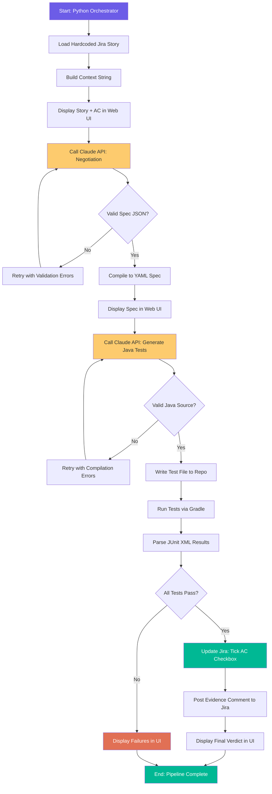
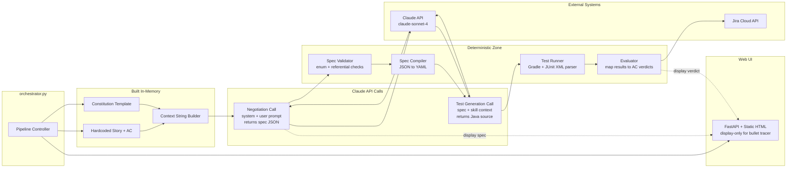
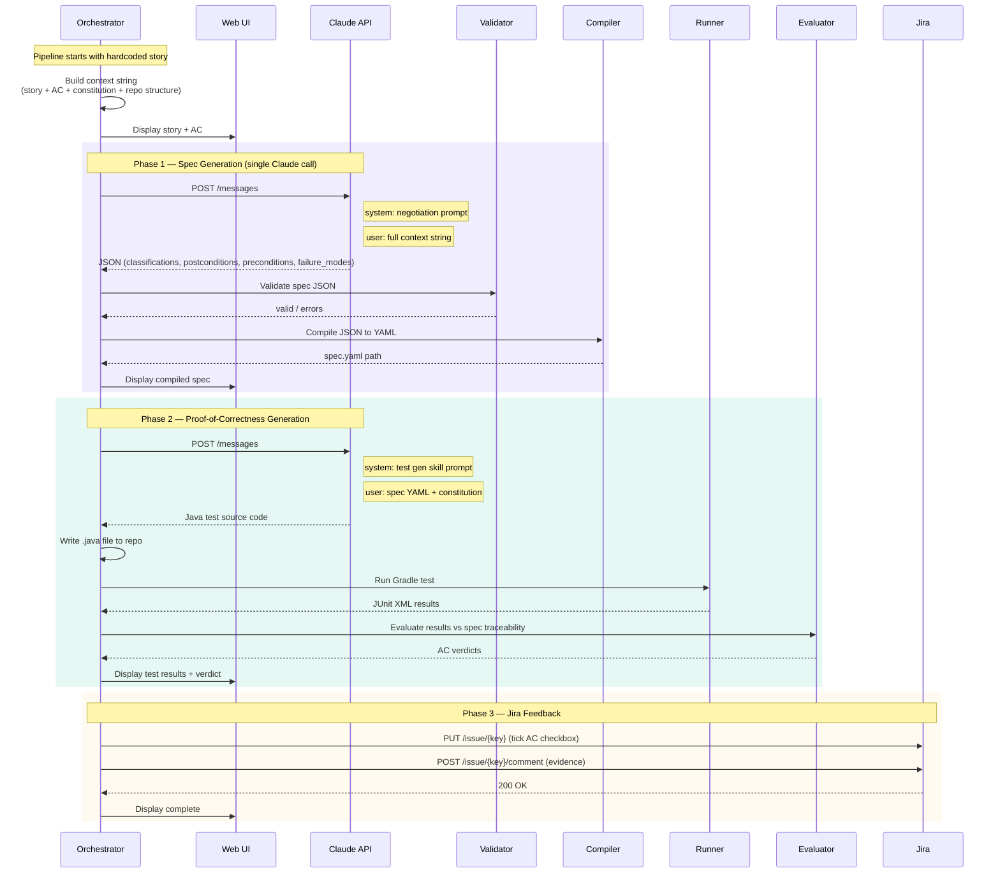
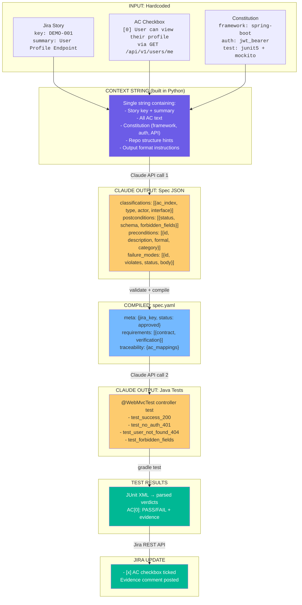
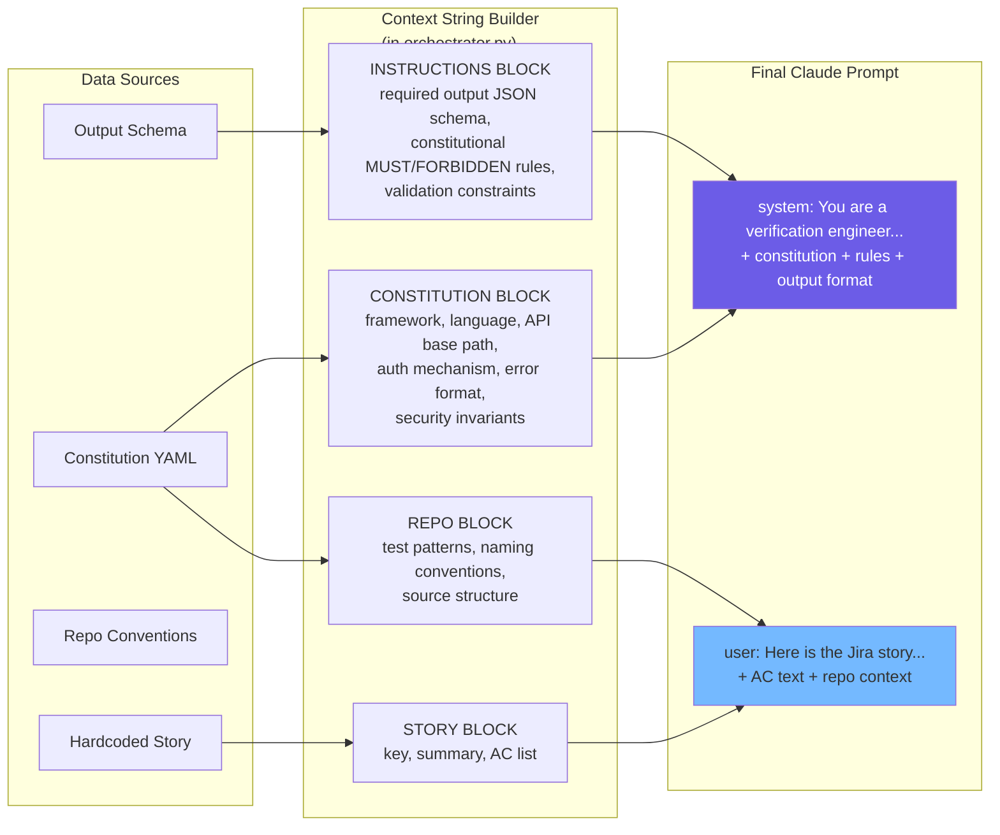
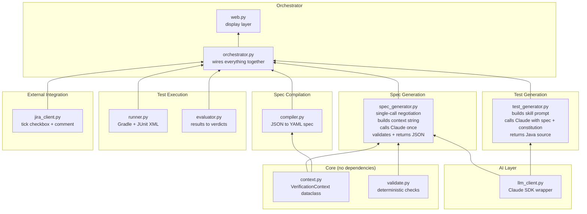
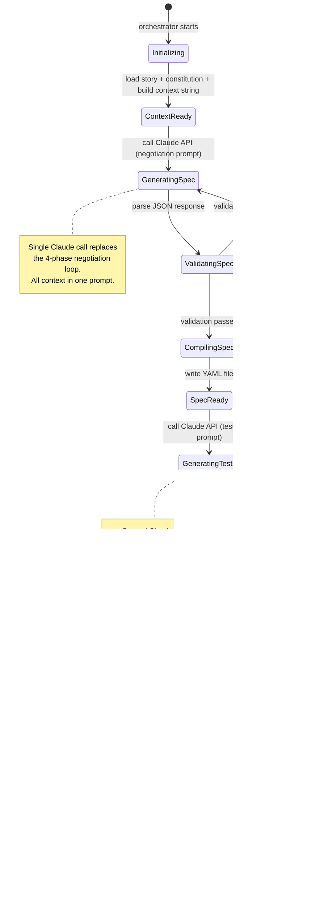

# Bullet Tracer — Initial Design

> One hardcoded Jira story, one AC, zero human negotiation.
> Straight-line pipeline: Jira -> Spec -> Java Tests -> Jira checkbox ticked.

---

## 1. End-to-End Logic Flow

The happy-path execution from start to finish. No branching, no human-in-the-loop.



---

## 2. Component View

Every box is a Python module or external system. Arrows show call direction.



---

## 3. Sequence Diagram

Who calls whom, in what order, with what data.



---

## 4. Data Transformation Pipeline

Shows how data changes shape at each stage.



---

## 5. Context String Assembly

What gets packed into the single Claude API call for spec generation.



---

## 6. Module Dependency Graph

Build order and import relationships for the bullet tracer.



---

## 7. State Machine

The orchestrator's internal state progression.



---

## 8. Hardcoded Story Definition

What the bullet tracer locks in. No Jira fetch needed for the tracer run.

```yaml
# Hardcoded in orchestrator.py
story:
  key: "DEMO-001"
  summary: "User can view their profile"
  acceptance_criteria:
    - index: 0
      text: "Authenticated user can retrieve their profile via GET /api/v1/users/me"
      checked: false

constitution:
  project:
    framework: spring-boot
    language: java
    version: 17
  api:
    base_path: "/api/v1"
    auth:
      mechanism: jwt_bearer
      claims: [sub, exp, iat]
    error_format:
      example: '{"error":"...","message":"...","timestamp":"...","path":"..."}'
  testing:
    unit_framework: junit5
    assertion_library: assertj
    mocking_library: mockito
    patterns: [controller_test, service_test]
  verification_standards:
    security_invariants:
      - "Never expose password, passwordHash, ssn, or internalId"
```

---

## Key Design Decisions

| Decision | Rationale |
|----------|-----------|
| **Single Claude call for spec** | Bullet tracer proves the pipe works. No negotiation loop, no human approval. One prompt with all context packed in. |
| **Context string built in Python** | The orchestrator file is the single source of truth for what Claude sees. No file-loading at runtime — everything is a string literal or assembled from hardcoded dicts. |
| **Java test generation (not Python)** | The constitution targets Spring Boot / JUnit5. This proves the system generates tests in the *project's* language, not the pipeline's language. |
| **Deterministic validation between calls** | Claude output is validated before compilation (spec JSON) and before execution (Java syntax). Retries are automatic with error feedback. |
| **Jira update is the final proof** | A ticked checkbox on a real Jira ticket is the end-to-end proof that the pipeline works from intent to verified outcome. |
| **Web UI is display-only** | For the bullet tracer, the UI shows progress and results. No interactive negotiation. The orchestrator drives everything. |
