# Magic Agents — System Design

## Intent-to-Verification Spec Engine

Transforms fuzzy Jira acceptance criteria into formal, machine-verifiable specifications through AI-driven negotiation, then dispatches to **Claude Agent Skills** that generate verification artifacts (tests, alert configs, compliance scenarios), runs them, and feeds verdicts back to Jira — closing the loop from business intent to verified software.

Both sides of the pipeline — **spec generation** (negotiation phases) and **proof-of-correctness generation** (verification skills) — are implemented as [Agent Skills](https://agentskills.io) following the SKILL.md open standard with progressive disclosure.

**Stack:** Python 3.11+ / FastAPI / pytest / Claude API
**References:** [reference-library.md](../reference-library.md) | [agent-skills-reference.md](../agent-skills-reference.md) | [ac-to-specs-plan.md](../ac-to-specs-plan.md)

---

## 1. End-to-End Pipeline

```mermaid
flowchart LR
    Jira["Jira Ticket\n(AC checkboxes)"] --> Ingest["AC Ingestion"]
    Ingest --> Negotiate["AI Negotiation\nPhases 1-4"]
    Negotiate --> Synthesis["Synthesis\n(invariants, EARS,\ntraceability)"]
    Synthesis --> Compile["Spec Compiler"]
    Compile --> Spec[".verify/specs/*.yaml"]
    Spec --> Route["Routing Table\n(deterministic)"]
    Route --> Generate["Agent Skills\n(proof-of-correctness\ngenerators)"]
    Generate --> Tests[".verify/generated/*\n(tests, configs,\nscenarios)"]
    Tests --> Run["Test Runner\n(pytest + JUnit XML)"]
    Run --> Evaluate["Evaluator\n(zero AI)"]
    Evaluate --> Verdicts["Verdicts\n(per AC checkbox)"]
    Verdicts --> Jira
```

---

## 2. Two-Zone Architecture

The spec YAML is the intelligence boundary. Both zones use **Claude Agent Skills** — but for fundamentally different purposes.

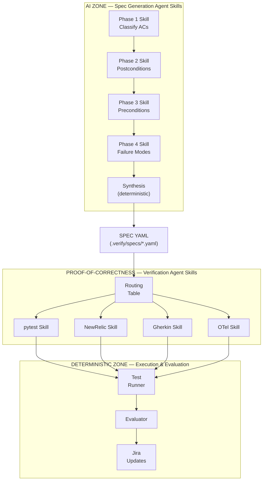

**Spec Generation Skills** (`.claude/skills/phase*-*/SKILL.md`) — AI interprets fuzzy AC into structured contracts through negotiation with the developer. Each phase is a Claude Agent Skill with constitutional rules.

**Proof-of-Correctness Skills** (`.claude/skills/verify-*/SKILL.md`) — Agent Skills that read the spec contract and generate verification artifacts: pytest tests, New Relic alert configs, Gherkin scenarios, OTel configs. Each skill follows the same SKILL.md standard — metadata for discovery, instructions for generation, templates as resources.

**Execution & Evaluation** — Fully deterministic. Run the generated artifacts, parse results, map back to AC checkboxes via the traceability map.

---

## 3. Epic Dependency Graph

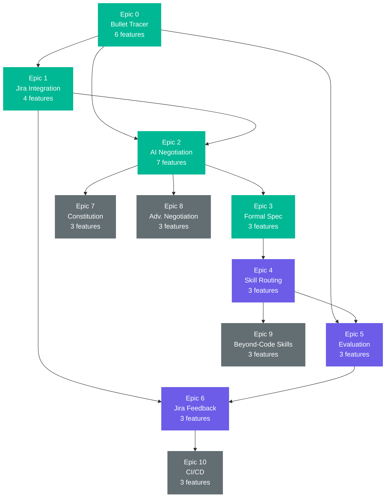

**Legend:** Green = complete | Purple = MVP (next) | Gray = stretch

---

## 4. Negotiation State Machine

The `NegotiationHarness` drives the `VerificationContext` through phases with guard conditions on each transition. Each phase includes validation, optional evaluator-optimizer critique, and checkpointing.

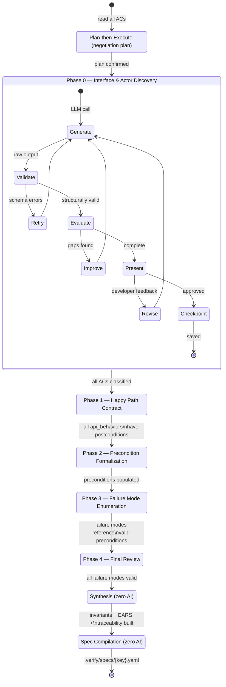

**Inner phase flow:** Generate → Validate (deterministic) → Evaluate (LLM critique) → Present (developer) → Checkpoint (persist). The evaluator-optimizer and checkpoint patterns apply to every phase.

---

## 5. VerificationContext Lifecycle

The single data object that threads through every phase, accumulating structured knowledge.

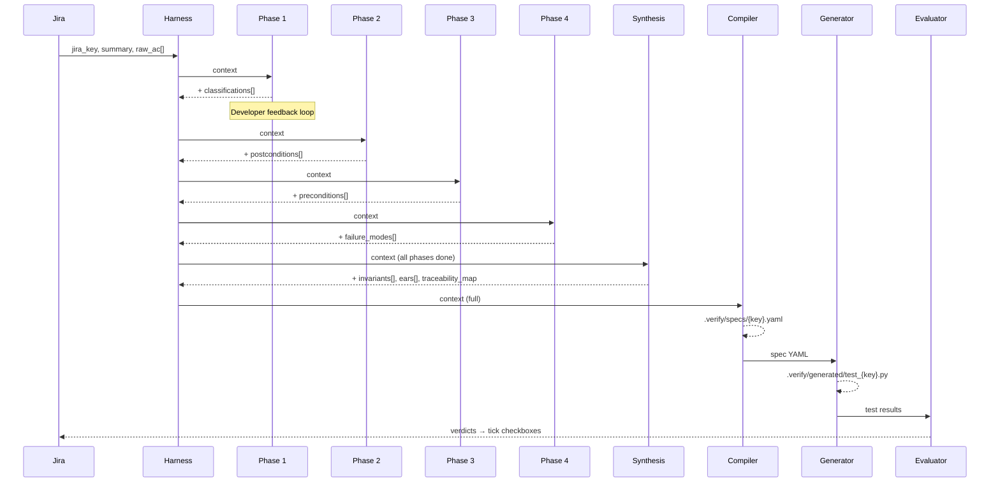

---

## 6. Agent Skills Architecture

**Both spec generation and proof-of-correctness generation are Claude Agent Skills.** They follow the same [SKILL.md open standard](https://agentskills.io) with the same progressive disclosure pattern — the only difference is what they produce.

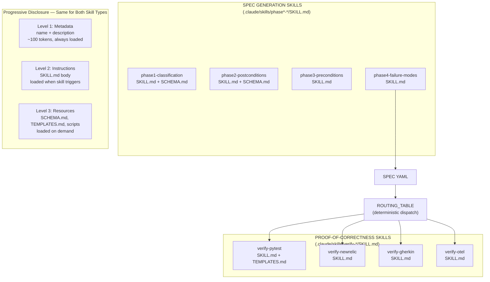

### How the Two Skill Types Compare

| | Spec Generation Skills | Proof-of-Correctness Skills |
|---|---|---|
| **Location** | `.claude/skills/phase*-*/` | `.claude/skills/verify-*/` |
| **Input** | Raw AC + constitution | Spec contract + constitution |
| **Output** | Structured data on VerificationContext | Verification artifacts (tests, configs, scenarios) |
| **AI role** | Interpret, classify, propose, negotiate | Generate code/configs from structured spec |
| **Validation** | `validate.py` (enum checks) | `tag_enforcer.py` (spec ref coverage) |
| **Developer interaction** | Feedback loop (approve/revise) | None (deterministic dispatch) |
| **Standard** | SKILL.md + SCHEMA.md | SKILL.md + TEMPLATES.md |

### Block's 3 Principles Applied (Both Skill Types)

| Principle | Spec Skills | Verification Skills |
|-----------|-------------|---------------------|
| **1. NOT decide** | `validate.py` enums, guard conditions | `tag_enforcer.py`, routing table |
| **2. SHOULD decide** | Interpreting AC, clarifying questions | Adapting templates to contract shapes |
| **3. Constitutional rules** | `MUST`/`FORBIDDEN` in prompts | `MUST tag every ref`, `MUST use TestClient` |

---

## 7. Routing Table

Deterministic mapping from requirement type to verification skill (zero AI):

| Requirement Type | Skill | Framework | Output Pattern |
|-----------------|-------|-----------|----------------|
| `api_behavior` | `pytest_unit_test` | pytest | `.verify/generated/test_{key}.py` |
| `performance_sla` | `newrelic_alert_config` | newrelic | `.verify/generated/{key}_alerts.json` |
| `security_invariant` | `pytest_unit_test` | pytest | `.verify/generated/test_{key}_security.py` |
| `observability` | `otel_config` | opentelemetry | `.verify/generated/{key}_otel.yaml` |
| `compliance` | `gherkin_scenario` | behave | `.verify/generated/{key}_compliance.feature` |
| `data_constraint` | `pytest_unit_test` | pytest | `.verify/generated/test_{key}_data.py` |

---

## 8. Epic Summary

| Epic | Name | Features | Agentic Patterns | Status | Playbook |
|------|------|----------|-----------------|--------|----------|
| 0 | Bullet Tracer | 6 | — | Foundation | [epic-0](epic-0-bullet-tracer/PLAYBOOK.md) |
| 1 | Jira Integration | 4 | — | Foundation | [epic-1](epic-1-jira-integration/PLAYBOOK.md) |
| 2 | AI Negotiation | 7 | State machine, belief system, feedback loop, constitutional AI, **checkpoint & resume, evaluator-optimizer, plan-then-execute** | Complete (patterns pending) | [epic-2](epic-2-ai-negotiation/PLAYBOOK.md) |
| 3 | Formal Spec Emission | 3 | Two-zone architecture, deterministic validation | Complete | [epic-3](epic-3-formal-spec/PLAYBOOK.md) |
| 4 | Verification Agent Skills | 3 | Progressive disclosure, Block's 3 Principles | MVP Next | [epic-4](epic-4-skill-routing/PLAYBOOK.md) |
| 5 | Evaluation Engine | 3 | Back-pressure (tag enforcement) | MVP Next | [epic-5](epic-5-evaluation/PLAYBOOK.md) |
| 6 | Jira Feedback | 3 | — | MVP Next | [epic-6](epic-6-jira-feedback/PLAYBOOK.md) |
| 7 | Constitution & RAG | 3 | **Code-grounded negotiation (RAG)** | Stretch | [epic-7](epic-7-constitution/PLAYBOOK.md) |
| 8 | Advanced Negotiation | 3 | **Multi-agent debate**, evaluator-optimizer | Stretch | [epic-8](epic-8-advanced-negotiation/PLAYBOOK.md) |
| 9 | Beyond-Code Skills | 3 | Progressive disclosure | Stretch | [epic-9](epic-9-verification-skills/PLAYBOOK.md) |
| 10 | CI/CD | 3 | **Spec drift detection** | Stretch | [epic-10](epic-10-cicd/PLAYBOOK.md) |

---

## 9. Agentic Patterns

Patterns that shape how AI agents operate within the pipeline. Each maps to a specific epic.

### Implemented

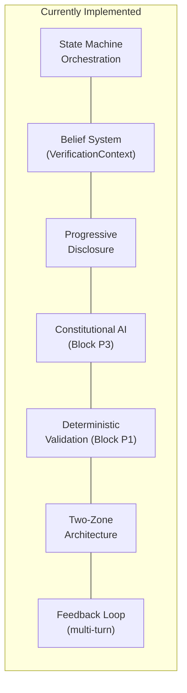

### Planned

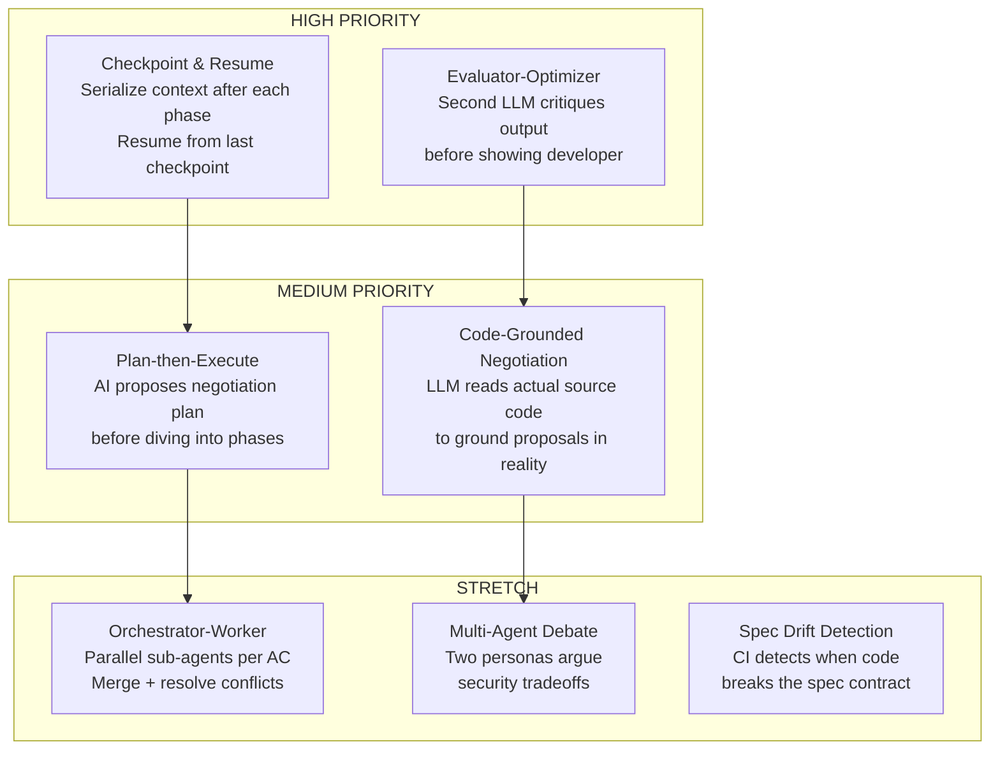

### Pattern Details

#### Checkpoint & Resume (Epic 2 enhancement)

**Problem:** Negotiation takes 10+ minutes. If the browser closes, all state is lost.
**Pattern:** Serialize `VerificationContext` to `.verify/sessions/{jira_key}/` after each phase advance. On startup, check for existing sessions and offer to resume.

```
.verify/sessions/{jira_key}/
├── checkpoint_phase0.json    # After classification
├── checkpoint_phase1.json    # After postconditions
├── checkpoint_phase2.json    # After preconditions
├── checkpoint_phase3.json    # After failure modes
├── checkpoint_synthesis.json # After synthesis
└── negotiation_log.jsonl     # Full conversation history
```

**Implementation:** The harness calls `save_checkpoint()` after each `advance_phase()`. The web UI checks for sessions on load and shows a "Resume" option. Maps to Sherpa's "agent persistence across sessions" capability ([reference-library.md §1](../reference-library.md#1-sherpa--model-driven-agent-orchestration-via-state-machines)).

#### Evaluator-Optimizer (Epic 2 enhancement)

**Problem:** LLM output can have subtle gaps (missing precondition categories, inconsistent status codes) that pass validation but aren't caught until the developer reviews.
**Pattern:** After each phase produces output, a second LLM call with an adversarial evaluator persona critiques it before presenting to the developer.

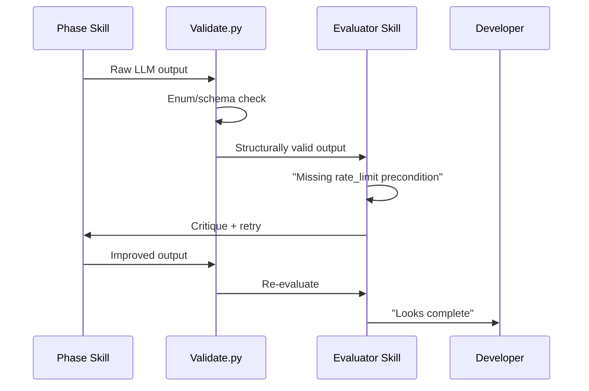

**Implementation:** A new Agent Skill at `.claude/skills/evaluator-optimizer/SKILL.md` with constitutional rules like "check every precondition category is addressed" and "verify failure modes cover both happy and unhappy subcategories." The harness calls it between validation and developer presentation. Maps to harness engineering's back-pressure pattern ([reference-library.md §3](../reference-library.md#3-harness-engineering--structuring-agent-environments-for-reliability)).

#### Plan-then-Execute (Epic 2 enhancement)

**Problem:** With multiple ACs, the AI dives into Phase 1 without considering the full picture. It might classify AC[0] as `api_behavior` and AC[3] as `security_invariant` but miss that they're related.
**Pattern:** Before Phase 1, the AI reads all ACs and proposes a negotiation plan — which ACs are related, which phases each needs, expected complexity. The developer confirms before execution.

```mermaid
sequenceDiagram
    participant AI as Planner Skill
    participant D as Developer
    participant H as Harness

    AI->>D: "5 ACs: 3 API behaviors, 1 perf SLA, 1 security invariant.
AC[0] and AC[4] are related (same endpoint).
Estimated: ~8 preconditions, ~15 failure modes.
Questions: [...]"
    D->>AI: "AC[3] is actually a data constraint, not perf SLA"
    AI->>H: Revised plan (configures state machine)
    H->>H: Execute plan (phases 1-4 per AC group)
```

**Implementation:** A new Agent Skill at `.claude/skills/negotiation-planner/SKILL.md`. The harness runs it as "Phase -1" before classification. The plan output configures which phases each AC flows through. Maps to Sherpa's "treat state machines as configurable data" principle ([reference-library.md §1](../reference-library.md#1-sherpa--model-driven-agent-orchestration-via-state-machines)).

#### Code-Grounded Negotiation / RAG (Epic 7 integration)

**Problem:** The AI proposes schemas and error codes based on convention, but the actual codebase may already implement things differently. The developer has to manually correct every mismatch.
**Pattern:** During phases 2-4, the LLM can call a `read_source(path, lines)` tool to inspect actual endpoint code, error handlers, and model definitions. Proposals are grounded in what's already implemented.

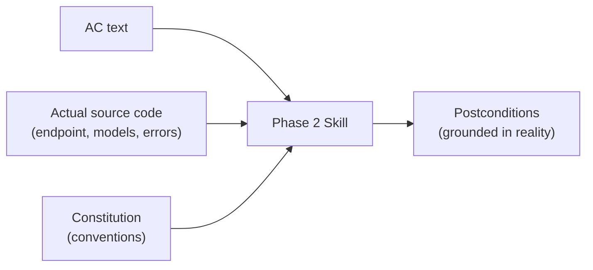

**Implementation:** Extend `LLMClient` with tool-use support. Add a `CodeSearchTool` that the LLM calls during negotiation. The constitution (Epic 7) provides file paths; the tool reads the actual code. Results are injected into the conversation as tool results, not the system prompt (respecting instruction budget). Maps to harness engineering's "tools & dispatch" pattern ([reference-library.md §3](../reference-library.md#3-harness-engineering--structuring-agent-environments-for-reliability)).

---

## 10. Design Influences

| Influence | What It Provides | Reference |
|-----------|-----------------|-----------|
| **Sherpa** | Hierarchical state machines, belief system, guard conditions | [reference-library.md §1](../reference-library.md#1-sherpa--model-driven-agent-orchestration-via-state-machines) |
| **Agent Skills** | Progressive disclosure, SKILL.md standard, Block's 3 Principles | [reference-library.md §2](../reference-library.md#2-agent-skills--modular-discoverable-capability-packages), [agent-skills-reference.md](../agent-skills-reference.md) |
| **Harness Engineering** | Context management, back-pressure, instruction budget | [reference-library.md §3](../reference-library.md#3-harness-engineering--structuring-agent-environments-for-reliability) |
| **BMAD** | Agent-as-code, documentation-first, versionable markdown agents | [reference-library.md §4](../reference-library.md#4-bmad--agent-as-code-agile-development-framework) |

---

## 10. Key Files

| Area | File | Purpose |
|------|------|---------|
| **Context** | `src/verify/context.py` | VerificationContext dataclass (Sherpa belief system) |
| **Negotiation** | `src/verify/negotiation/harness.py` | Phase state machine with guard conditions |
| | `src/verify/negotiation/phase1-4.py` | LLM-powered negotiation skills |
| | `src/verify/negotiation/validate.py` | Deterministic output validation |
| | `src/verify/negotiation/synthesis.py` | Post-negotiation: invariants, EARS, traceability |
| **Compiler** | `src/verify/compiler.py` | Context → YAML spec + routing table + traceability |
| **Pipeline** | `src/verify/generator.py` | Spec → pytest test file (to be replaced by verify-pytest skill) |
| | `src/verify/runner.py` | Run tests + parse JUnit XML |
| | `src/verify/evaluator.py` | Spec + results → verdicts |
| | `src/verify/pipeline.py` | End-to-end orchestrator |
| **Jira** | `src/verify/jira_client.py` | Read/write/search Jira Cloud REST API |
| **LLM** | `src/verify/llm_client.py` | Claude SDK + mock mode + multi-turn |
| **UI** | `static/index.html` | Web UI (Jira picker, negotiation, traceability) |
| **Spec Skills** | `.claude/skills/phase*-*/SKILL.md` | Negotiation phase skill definitions |
| **Verification Skills** | `.claude/skills/verify-*/SKILL.md` | Proof-of-correctness generator skills (Epic 4) |

---

## 11. Detailed Implementation Flow

Three connected flowcharts showing every step, interface, and data shape in the pipeline — color-coded by actor/system.

### Color Legend

| Color | Actor/System | Description |
|-------|-------------|-------------|
| **Blue** | Jira Cloud API | External ticket system — fetch stories, extract ACs, write back verdicts |
| **Teal** | Web UI | Frontend screens — story picker, AC overview, negotiation chat, traceability |
| **Purple** | AC→Spec (Negotiation) | LLM-powered phases 1-4 with constitutional prompts |
| **Indigo** | Spec→Test (Verification Skills) | Agent Skills that generate tests, configs, and scenarios |
| **Orange** | Orchestrator | Harness (state machine + guards), Pipeline, deterministic synthesis/compilation |
| **Dark Gray** | GitHub | PR creation, CI/CD workflows, Actions |
| **Green** | User | Human developer decisions — approve, feedback, review, fix |
| **Red** | Tests | Test runner, pytest execution, JUnit parsing |
| **Gold** | Artifacts | Files produced at each stage (.verify/specs, generated, results) |
| **Pink** | Evaluator | Maps test results to AC verdicts via traceability |

### Diagram A: Entry + AI Negotiation

```mermaid
flowchart TD
    classDef jira fill:#0984e3,color:#fff,stroke:#0984e3
    classDef ui fill:#00cec9,color:#000,stroke:#00cec9
    classDef acspec fill:#6c5ce7,color:#fff,stroke:#6c5ce7
    classDef orch fill:#e17055,color:#fff,stroke:#e17055
    classDef user fill:#00b894,color:#fff,stroke:#00b894
    classDef artifact fill:#fdcb6e,color:#000,stroke:#fdcb6e

    subgraph entry["JIRA INGESTION"]
        J1["Jira Cloud REST API v3"]:::jira
        J2["JiraClient.fetch_ticket(key)<br/>+ extract_acceptance_criteria()"]:::jira
        J3["JiraClient.get_in_progress_stories()<br/>JQL: status = In Progress"]:::jira
        J1 -->|"GET /rest/api/3/issue/{key}"| J2
        J1 -->|"GET /rest/api/3/search/jql"| J3
    end

    subgraph webui["WEB UI"]
        UI1["Story Picker<br/>GET /api/jira/stories"]:::ui
        U1["User selects story<br/>or enters manual ACs"]:::user
        UI2["AC Overview Screen<br/>display acceptance criteria"]:::ui
        UI3["Begin Negotiation<br/>button click"]:::user
    end

    J3 -->|"stories[]"| UI1
    UI1 --> U1
    U1 -->|"GET /api/jira/ticket/{key}"| J2
    J2 -->|"{key, summary, acceptance_criteria[]}"| UI2
    UI2 --> UI3

    subgraph init["ORCHESTRATOR INIT"]
        START["POST /api/start<br/>Create VerificationContext<br/>+ NegotiationHarness<br/>+ LLMClient"]:::orch
    end

    UI3 -->|"{jira_key, summary,<br/>acceptance_criteria[], constitution}"| START

    subgraph phase1["PHASE 1: INTERFACE & ACTOR DISCOVERY"]
        P1_LLM["run_phase1(ctx, llm)<br/>Constitutional system prompt<br/>+ raw ACs → Claude API"]:::acspec
        P1_VAL{"validate_classifications()<br/>type ∈ VALID_TYPES?<br/>actor ∈ VALID_ACTORS?<br/>all ACs covered?"}:::orch
        P1_CTX["ctx.classifications =<br/>{ac_index, type, actor, interface}"]:::artifact
        P1_UI["Present results +<br/>clarifying questions"]:::ui
        P1_DEC{"Developer<br/>decision"}:::user
        P1_FB["chat_multi() revision<br/>prev output + feedback<br/>→ revised classifications"]:::acspec
        P1_GUARD{"Guard: _phase_0_ok()<br/>every AC classified?"}:::orch

        P1_LLM --> P1_VAL
        P1_VAL -->|"invalid → retry up to 2x<br/>with errors appended"| P1_LLM
        P1_VAL -->|"valid"| P1_CTX
        P1_CTX --> P1_UI
        P1_UI --> P1_DEC
        P1_DEC -->|"feedback text"| P1_FB
        P1_FB --> P1_VAL
        P1_DEC -->|"approve"| P1_GUARD
    end

    START -->|"harness.phase = phase_0"| P1_LLM

    subgraph phase2["PHASE 2: HAPPY PATH CONTRACT"]
        P2_LLM["run_phase2(ctx, llm)<br/>api_behavior classifications<br/>+ constitution → Claude API"]:::acspec
        P2_VAL{"validate_postconditions()<br/>every api_behavior AC<br/>has postcondition?<br/>status is valid HTTP?"}:::orch
        P2_CTX["ctx.postconditions =<br/>{ac_index, status, schema,<br/>constraints, forbidden_fields}"]:::artifact
        P2_UI["Present postconditions +<br/>clarifying questions"]:::ui
        P2_DEC{"Developer<br/>decision"}:::user
        P2_FB["chat_multi() revision"]:::acspec
        P2_GUARD{"Guard: _phase_1_ok()<br/>api_behavior ACs<br/>⊆ postcond indices?"}:::orch

        P2_LLM --> P2_VAL
        P2_VAL -->|"invalid → retry"| P2_LLM
        P2_VAL -->|"valid"| P2_CTX
        P2_CTX --> P2_UI
        P2_UI --> P2_DEC
        P2_DEC -->|"feedback"| P2_FB
        P2_FB --> P2_VAL
        P2_DEC -->|"approve"| P2_GUARD
    end

    P1_GUARD -->|"advance_phase()"| P2_LLM

    subgraph phase3["PHASE 3: PRECONDITION FORMALIZATION"]
        P3_LLM["run_phase3(ctx, llm)<br/>postconditions + auth context<br/>Design by Contract → Claude API"]:::acspec
        P3_VAL{"validate_preconditions()<br/>IDs = PRE-NNN?<br/>category ∈ VALID?<br/>formal non-empty?"}:::orch
        P3_CTX["ctx.preconditions =<br/>{id: PRE-NNN, description,<br/>formal, category}"]:::artifact
        P3_UI["Present preconditions +<br/>clarifying questions"]:::ui
        P3_DEC{"Developer<br/>decision"}:::user
        P3_FB["chat_multi() revision"]:::acspec
        P3_GUARD{"Guard: _phase_2_ok()<br/>preconditions exist?"}:::orch

        P3_LLM --> P3_VAL
        P3_VAL -->|"invalid → retry"| P3_LLM
        P3_VAL -->|"valid"| P3_CTX
        P3_CTX --> P3_UI
        P3_UI --> P3_DEC
        P3_DEC -->|"feedback"| P3_FB
        P3_FB --> P3_VAL
        P3_DEC -->|"approve"| P3_GUARD
    end

    P2_GUARD -->|"advance_phase()"| P3_LLM

    subgraph phase4["PHASE 4: FAILURE MODE ENUMERATION"]
        P4_LLM["run_phase4(ctx, llm)<br/>preconditions + error format<br/>FMEA-inspired → Claude API"]:::acspec
        P4_VAL{"validate_failure_modes()<br/>IDs = FAIL-NNN?<br/>violates ∈ precond IDs?<br/>every PRE has ≥1 FAIL?"}:::orch
        P4_CTX["ctx.failure_modes =<br/>{id: FAIL-NNN, violates: PRE-NNN,<br/>description, status, body}"]:::artifact
        P4_UI["Present failure modes +<br/>security questions"]:::ui
        P4_DEC{"Developer<br/>decision"}:::user
        P4_FB["chat_multi() revision"]:::acspec
        P4_GUARD{"Guard: _phase_3_ok()<br/>all failure modes<br/>ref valid preconditions?"}:::orch

        P4_LLM --> P4_VAL
        P4_VAL -->|"invalid → retry"| P4_LLM
        P4_VAL -->|"valid"| P4_CTX
        P4_CTX --> P4_UI
        P4_UI --> P4_DEC
        P4_DEC -->|"feedback"| P4_FB
        P4_FB --> P4_VAL
        P4_DEC -->|"approve"| P4_GUARD
    end

    P3_GUARD -->|"advance_phase()"| P4_LLM
    P4_GUARD -->|"run_synthesis(ctx)"| CONN_A["▼ Continue to Diagram B:<br/>Synthesis & Compilation"]:::orch
```

### Diagram B: Synthesis + Spec Compilation + Skill Dispatch + PR

```mermaid
flowchart TD
    classDef jira fill:#0984e3,color:#fff,stroke:#0984e3
    classDef ui fill:#00cec9,color:#000,stroke:#00cec9
    classDef acspec fill:#6c5ce7,color:#fff,stroke:#6c5ce7
    classDef spectest fill:#4834d4,color:#fff,stroke:#4834d4
    classDef orch fill:#e17055,color:#fff,stroke:#e17055
    classDef gh fill:#636e72,color:#fff,stroke:#636e72
    classDef user fill:#00b894,color:#fff,stroke:#00b894
    classDef artifact fill:#fdcb6e,color:#000,stroke:#fdcb6e

    CONN_IN["▲ From Diagram A:<br/>Phase 4 approved"]:::orch

    subgraph synthesis["DETERMINISTIC SYNTHESIS (Zero AI)"]
        SYN1["extract_invariants()<br/>constitution.security_invariants<br/>+ postcondition.forbidden_fields"]:::orch
        SYN2["generate_ears_statements()<br/>WHEN/IF/WHILE patterns<br/>from all contract elements"]:::orch
        SYN3["build_traceability_map()<br/>AC checkbox → required<br/>verification refs"]:::orch

        SYN1_OUT["ctx.invariants =<br/>{id: INV-NNN, description, category}"]:::artifact
        SYN2_OUT["ctx.ears_statements =<br/>WHEN event THEN system SHALL action<br/>IF condition THEN response<br/>WHILE state system SHALL property"]:::artifact
        SYN3_OUT["ctx.traceability_map =<br/>{ac_mappings: [{ac_checkbox,<br/>pass_condition,<br/>required_verifications[]}]}"]:::artifact

        SYN1 --> SYN1_OUT
        SYN1_OUT --> SYN2
        SYN2 --> SYN2_OUT
        SYN2_OUT --> SYN3
        SYN3 --> SYN3_OUT
    end

    CONN_IN -->|"run_synthesis(ctx)"| SYN1

    subgraph compile["SPEC COMPILATION (Deterministic)"]
        CC1["compile_spec(context)<br/>_build_meta()<br/>_build_requirements()<br/>_build_traceability()"]:::orch
        CC2["ROUTING_TABLE lookup<br/>requirement type → skill"]:::orch
        CC3["write_spec(spec, output_dir)<br/>YAML serialization"]:::orch
        CC4[".verify/specs/{KEY}.yaml<br/>meta + requirements<br/>+ verification routing<br/>+ traceability"]:::artifact
    end

    SYN3_OUT -->|"compile_and_write(ctx)"| CC1
    CC1 -->|"for each requirement:<br/>route = ROUTING_TABLE[type]"| CC2
    CC2 --> CC3
    CC3 --> CC4

    subgraph routing["ROUTING TABLE (Zero AI)"]
        R1["api_behavior → pytest_unit_test"]:::orch
        R2["performance_sla → newrelic_alert_config"]:::orch
        R3["security_invariant → pytest_unit_test"]:::orch
        R4["observability → otel_config"]:::orch
        R5["compliance → gherkin_scenario"]:::orch
        R6["data_constraint → pytest_unit_test"]:::orch
    end

    CC2 -.->|"deterministic mapping"| routing

    subgraph dispatch["VERIFICATION SKILL DISPATCH"]
        SR["Skill Router<br/>reads spec.verification[].skill"]:::orch

        SK1["verify-pytest<br/>SKILL.md + TEMPLATES.md<br/>Agent Skill"]:::spectest
        SK2["verify-newrelic<br/>SKILL.md<br/>Agent Skill"]:::spectest
        SK3["verify-otel<br/>SKILL.md<br/>Agent Skill"]:::spectest
        SK4["verify-gherkin<br/>SKILL.md<br/>Agent Skill"]:::spectest

        ART1[".verify/generated/test_{key}.py<br/>tagged [REQ-NNN.success]<br/>tagged [REQ-NNN.FAIL-NNN]<br/>tagged [REQ-NNN.INV-NNN]"]:::artifact
        ART2[".verify/generated/<br/>{key}_alerts.json"]:::artifact
        ART3[".verify/generated/<br/>{key}_otel.yaml"]:::artifact
        ART4[".verify/generated/<br/>{key}.feature"]:::artifact

        SR -->|"api_behavior /<br/>security / data"| SK1
        SR -->|"performance_sla"| SK2
        SR -->|"observability"| SK3
        SR -->|"compliance"| SK4

        SK1 --> ART1
        SK2 --> ART2
        SK3 --> ART3
        SK4 --> ART4
    end

    CC4 -->|"spec YAML path"| SR

    subgraph github["GITHUB PR CREATION"]
        GH1["Create branch<br/>verify/{jira_key}"]:::gh
        GH2["Commit spec YAML +<br/>all generated artifacts"]:::gh
        GH3["gh pr create<br/>EARS statements +<br/>traceability table in body"]:::gh
        GH4["Developer reviews PR"]:::user
    end

    ART1 & ART2 & ART3 & ART4 -->|"generated artifacts"| GH1
    CC4 -->|"spec file"| GH2
    GH1 --> GH2 --> GH3 --> GH4
    GH4 -->|"PR triggers CI"| CONN_B["▼ Continue to Diagram C:<br/>CI + Evaluation"]:::gh
```

### Diagram C: CI Execution + Evaluation + Feedback Loop

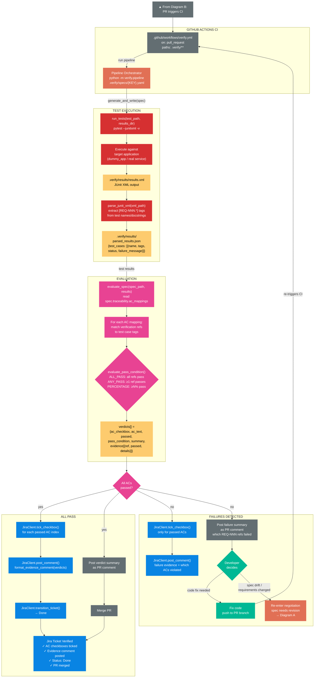
