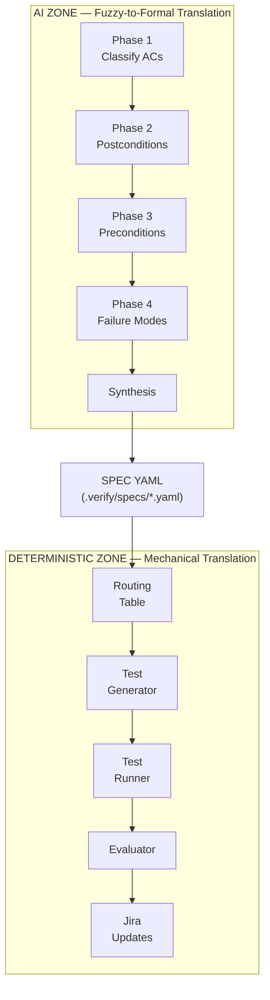
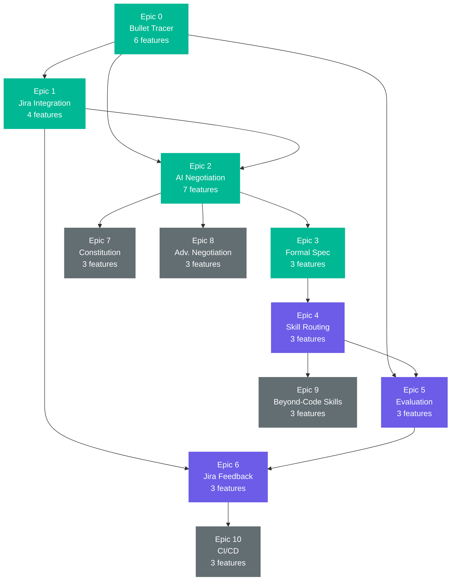
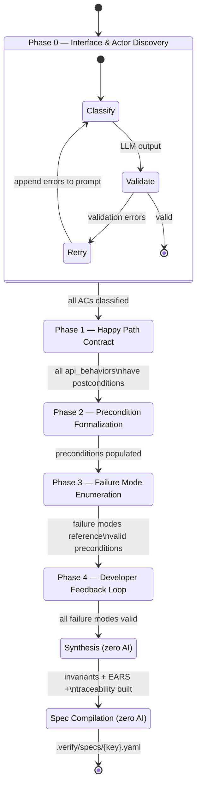
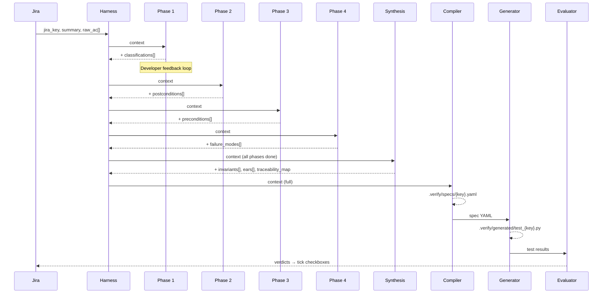
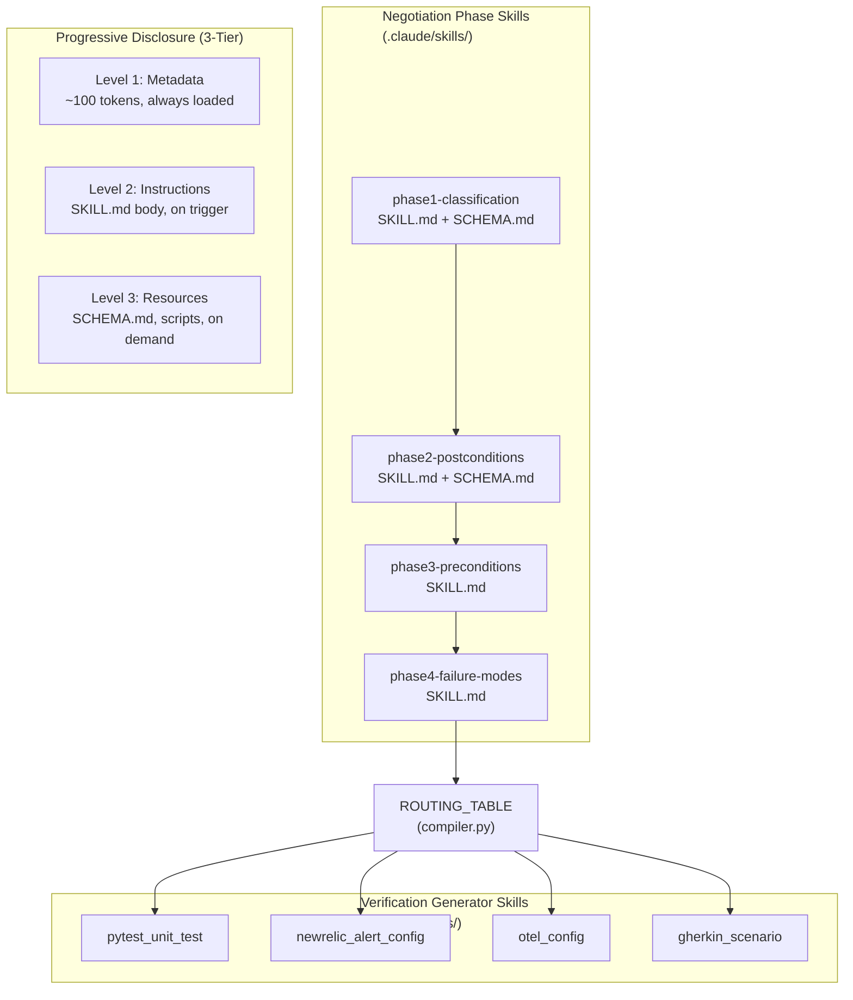

# Magic Agents — System Design

## Intent-to-Verification Spec Engine

Transforms fuzzy Jira acceptance criteria into formal, machine-verifiable specifications through AI-driven negotiation, then generates tests, runs them, and feeds verdicts back to Jira — closing the loop from business intent to verified software.

**Stack:** Python 3.11+ / FastAPI / pytest / Claude API
**References:** [reference-library.md](../reference-library.md) | [agent-skills-reference.md](../agent-skills-reference.md) | [ac-to-specs-plan.md](../ac-to-specs-plan.md)

---

## 1. End-to-End Pipeline

```mermaid
flowchart LR
    Jira["Jira Ticket\n(AC checkboxes)"] --> Ingest["AC Ingestion"]
    Ingest --> Negotiate["AI Negotiation\nPhases 1-4"]
    Negotiate --> Synthesis["Synthesis\n(invariants, EARS,\ntraceability)"]
    Synthesis --> Compile["Spec Compiler"]
    Compile --> Spec[".verify/specs/*.yaml"]
    Spec --> Route["Routing Table\n(deterministic)"]
    Route --> Generate["Test Generator\n(skill dispatch)"]
    Generate --> Tests[".verify/generated/*"]
    Tests --> Run["Test Runner\n(pytest + JUnit XML)"]
    Run --> Evaluate["Evaluator\n(zero AI)"]
    Evaluate --> Verdicts["Verdicts\n(per AC checkbox)"]
    Verdicts --> Jira
```

---

## 2. Two-Zone Architecture

The spec YAML is the intelligence boundary. Everything above it uses AI; everything below is deterministic.

---

## 3. Epic Dependency Graph

**Legend:** Green = complete | Purple = MVP (next) | Gray = stretch

---

## 4. Negotiation State Machine

The `NegotiationHarness` drives the `VerificationContext` through phases with guard conditions on each transition.

---

## 5. VerificationContext Lifecycle

The single data object that threads through every phase, accumulating structured knowledge.

---

## 6. Agent Skills Architecture

Two layers of skills following the [Agent Skills open standard](https://agentskills.io):

### Block's 3 Principles Applied

| Principle | What | Example |
|-----------|------|---------|
| **1. Agents should NOT decide** | Deterministic operations | `validate.py` enums, `tag_enforcer.py`, routing table lookup |
| **2. Agents SHOULD decide** | Context-dependent reasoning | Interpreting AC text, generating clarifying questions |
| **3. Constitutional rules** | Explicit constraints | `MUST`/`FORBIDDEN` in prompts, strict output schemas |

---

## 7. Routing Table

Deterministic mapping from requirement type to verification skill (zero AI):

| Requirement Type | Skill | Framework | Output Pattern |
|-----------------|-------|-----------|----------------|
| `api_behavior` | `pytest_unit_test` | pytest | `.verify/generated/test_{key}.py` |
| `performance_sla` | `newrelic_alert_config` | newrelic | `.verify/generated/{key}_alerts.json` |
| `security_invariant` | `pytest_unit_test` | pytest | `.verify/generated/test_{key}_security.py` |
| `observability` | `otel_config` | opentelemetry | `.verify/generated/{key}_otel.yaml` |
| `compliance` | `gherkin_scenario` | behave | `.verify/generated/{key}_compliance.feature` |
| `data_constraint` | `pytest_unit_test` | pytest | `.verify/generated/test_{key}_data.py` |

---

## 8. Epic Summary

| Epic | Name | Features | Status | Playbook |
|------|------|----------|--------|----------|
| 0 | Bullet Tracer | 6 | Foundation | [docs/epic-0-bullet-tracer/](epic-0-bullet-tracer/PLAYBOOK.md) |
| 1 | Jira Integration | 4 | Foundation | [docs/epic-1-jira-integration/](epic-1-jira-integration/PLAYBOOK.md) |
| 2 | AI Negotiation | 7 | Complete | [docs/epic-2-ai-negotiation/](epic-2-ai-negotiation/PLAYBOOK.md) |
| 3 | Formal Spec Emission | 3 | Complete | [docs/epic-3-formal-spec/](epic-3-formal-spec/PLAYBOOK.md) |
| 4 | Skill Routing | 3 | MVP Next | [docs/epic-4-skill-routing/](epic-4-skill-routing/PLAYBOOK.md) |
| 5 | Evaluation Engine | 3 | MVP Next | [docs/epic-5-evaluation/](epic-5-evaluation/PLAYBOOK.md) |
| 6 | Jira Feedback | 3 | MVP Next | [docs/epic-6-jira-feedback/](epic-6-jira-feedback/PLAYBOOK.md) |
| 7 | Constitution | 3 | Stretch | [docs/epic-7-constitution/](epic-7-constitution/PLAYBOOK.md) |
| 8 | Advanced Negotiation | 3 | Stretch | [docs/epic-8-advanced-negotiation/](epic-8-advanced-negotiation/PLAYBOOK.md) |
| 9 | Beyond-Code Skills | 3 | Stretch | [docs/epic-9-verification-skills/](epic-9-verification-skills/PLAYBOOK.md) |
| 10 | CI/CD | 3 | Stretch | [docs/epic-10-cicd/](epic-10-cicd/PLAYBOOK.md) |

---

## 9. Design Influences

| Influence | What It Provides | Reference |
|-----------|-----------------|-----------|
| **Sherpa** | Hierarchical state machines, belief system, guard conditions | [reference-library.md §1](../reference-library.md#1-sherpa--model-driven-agent-orchestration-via-state-machines) |
| **Agent Skills** | Progressive disclosure, SKILL.md standard, Block's 3 Principles | [reference-library.md §2](../reference-library.md#2-agent-skills--modular-discoverable-capability-packages), [agent-skills-reference.md](../agent-skills-reference.md) |
| **Harness Engineering** | Context management, back-pressure, instruction budget | [reference-library.md §3](../reference-library.md#3-harness-engineering--structuring-agent-environments-for-reliability) |
| **BMAD** | Agent-as-code, documentation-first, versionable markdown agents | [reference-library.md §4](../reference-library.md#4-bmad--agent-as-code-agile-development-framework) |

---

## 10. Key Files

| Area | File | Purpose |
|------|------|---------|
| **Context** | `src/verify/context.py` | VerificationContext dataclass (Sherpa belief system) |
| **Negotiation** | `src/verify/negotiation/harness.py` | Phase state machine with guard conditions |
| | `src/verify/negotiation/phase1-4.py` | LLM-powered negotiation skills |
| | `src/verify/negotiation/validate.py` | Deterministic output validation |
| | `src/verify/negotiation/synthesis.py` | Post-negotiation: invariants, EARS, traceability |
| **Compiler** | `src/verify/compiler.py` | Context → YAML spec + routing table + traceability |
| **Pipeline** | `src/verify/generator.py` | Spec → pytest test file |
| | `src/verify/runner.py` | Run tests + parse JUnit XML |
| | `src/verify/evaluator.py` | Spec + results → verdicts |
| | `src/verify/pipeline.py` | End-to-end orchestrator |
| **Jira** | `src/verify/jira_client.py` | Read/write/search Jira Cloud REST API |
| **LLM** | `src/verify/llm_client.py` | Claude SDK + mock mode + multi-turn |
| **UI** | `static/index.html` | Web UI (Jira picker, negotiation, traceability) |
| **Skills** | `.claude/skills/phase*-*/SKILL.md` | Negotiation phase skill definitions |
